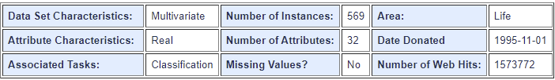
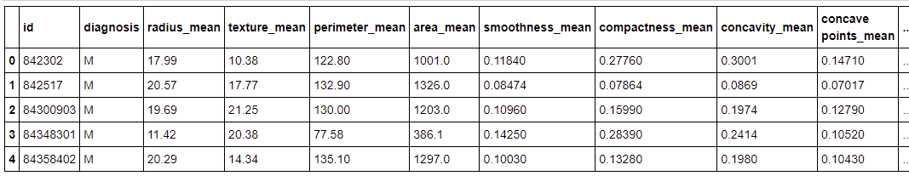
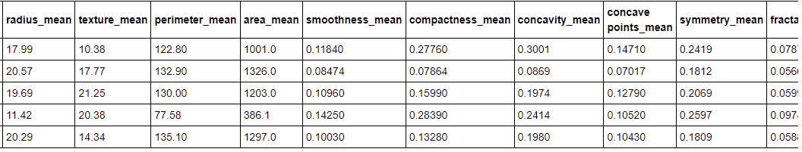
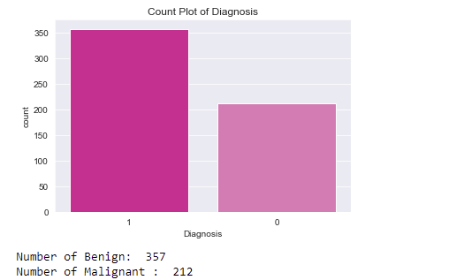
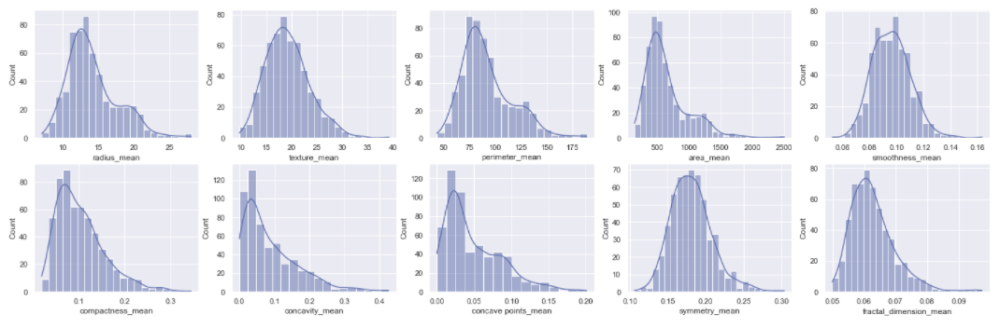
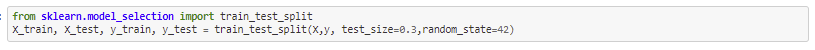

# Breast Cancer Classification using Machine Learning

The goal of this analysis was to train machine learning algorithms to accurately distinguish between a benign and malignant tumor to aid in clinical diagnosis.

### Project URL: (https://qsun21.github.io/project3/) 

### Database: [Heroku] (https://qian-mario-mohamed-pamproject3.herokuapp.com/data)

## Data Preparation:

## Imports:

We used Numpy, Pandas, Matplotlib and Seaborn libraries to manipulate the data and build the ML model.

## Loading the Data:

The measurements and data we used came from the Breast Cancer Wisconsin (Diagnostic) Data Set obtained from the [UCI Machine Learning Repository](https://archive.ics.uci.edu/ml/datasets/Breast+Cancer+Wisconsin+(Diagnostic)) webpage.]. There are a total of 569 data samples and 30 features associated with them. Out of which 212 are malignant samples and 357 are benign.

bcdata.png

There are 10 main features in the dataset, and for each (the mean, error, or standard error and worst or largest) for all these features were calculated thus giving us a total of 30 features to work with.

Ten real-valued features which are calculated for each cell nucleus:
1.	radius (computed as mean distances from center to points on perimeter)
2.	texture (it is standard deviation of gray-scale values)
3.	area
4.	perimeter
5.	smoothness (variation in radius lengths)
6.	compactness (perimeter^2 / area – 1.0)
7.	concavity (severity of concave portions of the contour)
8.	concave points (total number of concave portions of the contour)
9.	symmetry
10.	fractal dimension (“coastline approximation” – 1)

## Understanding the Data:

The image below shows the format of this data. The first column contains the patients' ID’s, which are used instead of names to protect confidentiality. The second column contains either an M or B. The M stands for malignant, which is the term used to describe a cancerous tumor able to quickly spread onto other tissues and B stands for benign, which is a tumor that has not yet become cancerous and has a much higher patient survival rate. The rest of the columns contain qualitative and quantitative data samples.

## Cleaning the Data:

The next step preformed was the removal of missing values or unnecessary data. The removal of the column containing the patient ID, was not important for our purpose and was therefore removed from the dataset as shown below.

## Creating Visualizations:

After the cleaning of the data, we created several visualizations. Here are just a few examples:

A Count Plot showing the number of Malignant and Benign tumors

A series of Distribution Plots for the 10 key features.

## Splitting the dataset:

To assess the performance of the model’s, we divided the dataset into two parts: a training set and a test set. The first is used to train the system, while the second is used to evaluate the learned or trained system. 

We used the sklearn.model_selection.train_test_split to split the dataset.

* We fixed the seed to 42 for the random number generator, in order to get reproducible results.

## Machine Learning Models:

* Logistical Regression Model: is used to estimate discrete values (usually binary values like 0/1) from a set of independent variables. It helps predict the probability of an event by fitting data to a logit function.

* Decision Tree:  is a supervised learning algorithm that is used for classifying problems. It works well classifying for both categorical and continuous dependent variables.

* Random Forest Model: is comprised of a set of decision trees, each of which is trained on a random subset of the training data. These trees predictions can then be aggregated to provide a single prediction from a series of predictions.

* Support Vector Model: is mostly used for classification tasks but it is also suitable for regression tasks.

* K-Nearest Neighbor (KNN): is a supervised learning algorithm that can be used to solve both classification and regression tasks. The main idea behind kNN is that the value or class of a data point is determined by the data points around it.

* Neural Network Model with Keras Tensorflow: is an open source library for numerical computation and large-scale machine learning. TensorFlow bundles together a slew of machine learning and deep learning (aka neural networking) models and algorithms and makes them useful by way of a common metaphor.

## Summary
We have successfully built a breast cancer classification system project that is accurate and can help in identifying major kinds of breast cancer.

